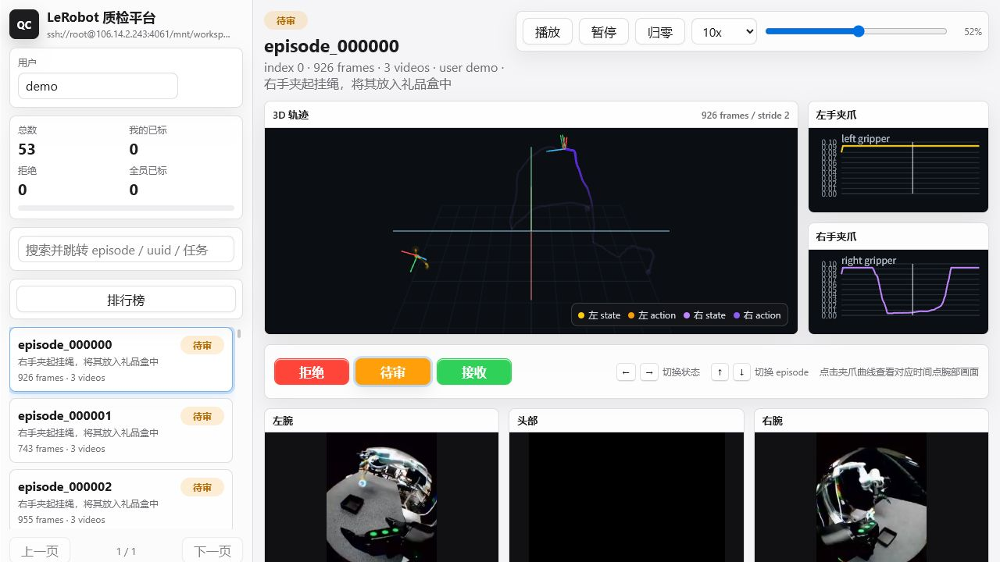
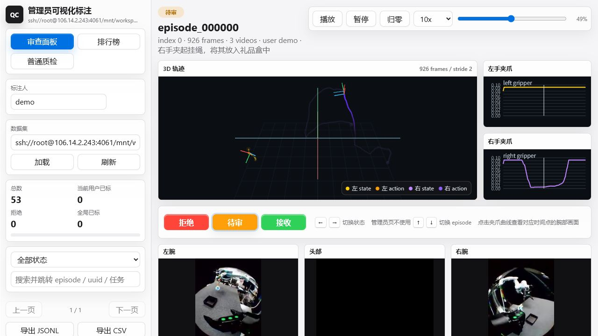
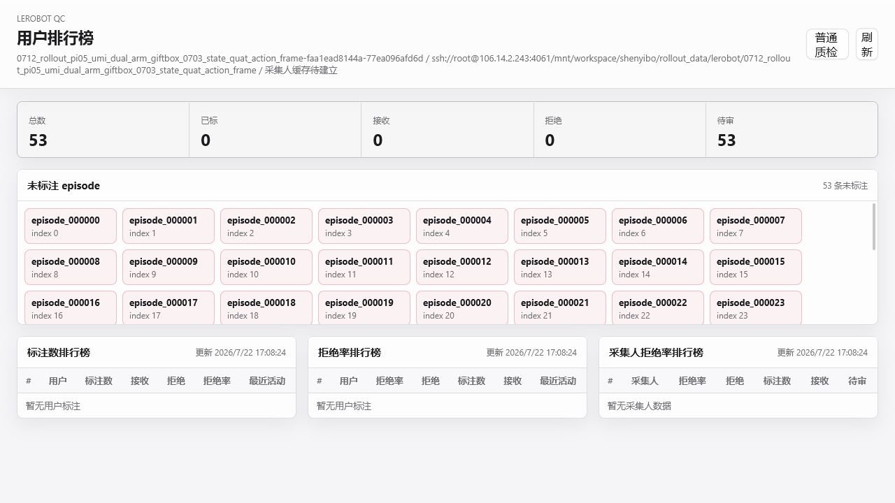
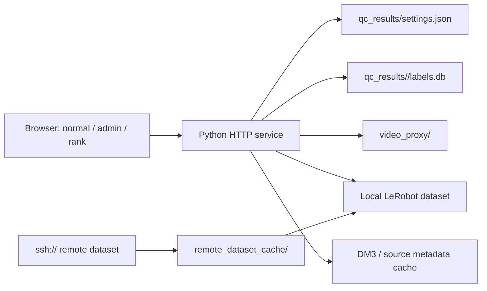

# LeRobot Quality Check Platform

面向 LeRobot v2/v2.1 数据集的多人在线人工质检平台。标注员可以快速浏览三路视频、左右手夹爪曲线和手部 state/action 轨迹，并把每个 episode 标为 `reject`、`pending` 或 `accept`。平台把当前有效状态写入 SQLite，同时保留操作事件，便于多人并行、导出、筛选和复盘。

> 页面截图来自 dev 服务的演示数据集。数据集路径、episode 数和排行榜内容会随当前 settings 改变。







## 功能概览

- 多人并行标注：一个 episode 的最终状态对所有用户可见；普通质检页会显示其他用户的短时占用锁，避免重复处理。
- 三态质检：`reject`、`pending`、`accept`。普通质检页支持左右方向键切换状态、上下方向键在当前列表中切换 episode。
- 同步可视化：左腕、头部、右腕视频共享进度，默认 `3x` 循环播放；夹爪曲线始终使用 `0-0.1` 的 y 轴范围。
- 3D 轨迹：渲染左右手的 state 与 action 四条轨迹，带有当前播放位置的流动高亮、局部坐标轴和可拖拽视角。头部 pose 仅用于相机初始朝向，不绘制头部轨迹。
- 腕部细查：点击夹爪曲线可在暂停的半透明弹窗中打开对应腕部视频，并从点击时刻开始查看。
- 管理员能力：`/admin/review` 可设置本地路径或 `ssh://` 数据集来源、忽略占用锁、按状态筛选和强制标注；`/admin` 只读汇总；`/rank` 提供标注员和采集人复盘。
- 远程数据集：管理员可直接加载 SSH URI。服务端会把数据集 materialize 到本地缓存后再读取 Parquet 和视频，避免浏览器跨主机访问。
- 多数据集合并：settings 可同时配置任意多个本地或 SSH 数据集。普通质检页会合并显示全部 episode，并在每条记录上保留来源数据集；标注和视频代理仍按各自 `dataset_id` 隔离。

## 页面与权限

| 路径 | 用途 | 关键能力 |
|---|---|---|
| `/` | 普通质检 | 多人锁、键盘切换、搜索跳转、视频和 3D 同步 |
| `/admin/review` | 管理员质检 | 数据集设置、本地/SSH 来源、状态筛选、无视锁标注 |
| `/admin` | 管理员统计 | 用户标注量、当前占用、最近标注，只读 |
| `/rank` | 排行榜与复盘 | 标注数、拒绝率、采集人拒绝率、未标注 episode |
| `/phone` | 移动端质检 | 触控和滑动优先的紧凑布局 |

普通质检页不会让标注员切换数据集。用户名会通过 cookie 关联到服务端会话，并在一周未刷新后自动清理。管理员质检页中的数据集输入框使用服务器 settings 作为权威来源：正在编辑时不会被轮询覆盖，失焦后会与当前设置同步。

## 系统结构



`dataset_source` 是管理员配置的本地路径或 SSH URI；`dataset_path` 是服务真正加载的本地目录或缓存目录。对于 SSH 数据集，这两个字段本来就不同。`/api/settings`、`/api/health` 和 episode 列表都会返回这对字段与一致的 `dataset_id`。

## 标注工作流

1. 输入用户名，平台自动保存会话身份。
2. 在左侧搜索 episode、UUID 或任务描述，结果会直接跳转到匹配 episode。
3. 观看同步视频、夹爪曲线和 3D 轨迹。普通页可用以下快捷键：

| 按键 | 行为 |
|---|---|
| `Left` / `Right` | 在 `reject -> pending -> accept` 中切换，不循环 |
| `Up` / `Down` | 在当前列表中切换上一条/下一条可用 episode，跳过其他用户锁定项 |
| `R` / `P` / `A` | 直接设置 `reject` / `pending` / `accept` |
| `Space` | 播放或暂停三路视频 |
| `Esc` | 关闭腕部视频弹窗 |

状态写入成功后会立即广播到轮询中的客户端。普通页约每 2 秒同步一次列表和当前 episode；管理员页可以无视临时占用锁，但不使用上下方向键切换 episode。

## 可视化约定

- 左右手轨迹使用黄/紫色系，与夹爪曲线对应。
- 3D 面板显示左右手 `state` 和 `action`，常态低透明度，当前播放点前方一小段轨迹逐渐高亮；用户拖拽或缩放的相机不会被播放刷新重置。
- 每条当前手部轨迹只显示一个加粗局部坐标轴，避免稀疏采样坐标轴造成噪声。
- `device_type` 会参与轨迹坐标处理。`teleoperation*`、`inference_r1` 与 `rollout` 使用 teleop 兼容分支；其他设备类型保留默认坐标约定。
- 头部视频与左右腕视频按各自原始比例显示，三路同步默认 `3x` 自动循环。腕部弹窗固定 `1x` 且初始暂停。

## 数据集要求

平台读取标准 LeRobot 布局：

```text
dataset_root/
  meta/
    info.json
    episodes.jsonl
    tasks.jsonl
  data/
    chunk-000/
      episode_000000.parquet
  videos/
    chunk-000/
      observation.images.image/
      observation.images.wrist_image_1/
      observation.images.wrist_image_2/
```

轨迹优先从 `observation.state` 与 `action` 读取，并兼容 `observation.extra.{left,right,ego}.raw_pose`、手部状态和有效性 mask。Parquet 中的 pose 约定为 `[x, y, z, qw, qx, qy, qz]`。数据集元数据中的 `device_type` 决定需要采用的显示坐标兼容分支。

`videos/` 不是强制目录。`iphone_umi1.0` 数据集使用 `robot_type=umi_dual_arm_quat_3view`，三路 PNG 图像作为 Parquet 的 `head_image`、`left_wrist_image`、`right_wrist_image` struct 列内嵌保存，同时使用 `state` 和 `actions` 两个 23 维列：

```text
state/actions = left[pos3, quat_wxyz4, gripper1]
              + right[pos3, quat_wxyz4, gripper1]
              + head[zero7]
```

服务端会在首次打开 episode 时按需把这三列编码到 `video_proxy/<dataset_id>/embedded_videos/`，随后继续使用普通的 Range 视频代理。该类型原始坐标为 z-up，平台显示转换为 y-up，并记录在轨迹 metadata 的 `source_world_up_axis`、`world_up_axis`、`state_layout` 和 `quaternion_order` 字段中。

## 标注存储与导出

运行时状态不写回原始数据集，而是保存在项目目录：

```text
qc_results/
  settings.json
  <dataset_id>/
    labels.db
    labels.json
    labels.jsonl
```

- `labels.db` 是唯一的当前标注真相来源，启用 WAL 和事务写入。
- `labels` 表为每个 `(dataset_id, episode_index)` 保存一条 canonical 状态；`label_events` 保存历史事件。
- `labels.json` 与 `labels.jsonl` 是兼容导出，不应作为并发写入来源。
- 通过 `/api/export.jsonl` 和 `/api/export.csv` 导出最终状态。筛选训练数据时优先按 episode UUID 匹配，而不是假定 regenerated dataset 的 `episode_index` 不变。

## 启动与健康检查

生产服务目录为 `/mnt/LerobotQualityCheckPlatform`，dev 工作树为 `/mnt/LerobotQualityCheckPlatform-dev`。生产不是 Git 工作树；所有代码开发先在 dev 的 `server-dev-18081` 分支进行。

```bash
# Production, port 18080
cd /mnt/LerobotQualityCheckPlatform
HOST=0.0.0.0 PORT=18080 ./run.sh

# Development, port 18081
cd /mnt/LerobotQualityCheckPlatform-dev
HOST=0.0.0.0 PORT=18081 ./run.sh
```

`run.sh` 的 `DATASET_PATH` 只是服务首次启动时的 fallback。已存在的 `qc_results/settings.json` 会优先决定实际数据集。检查当前运行状态：

```bash
curl -fsS http://127.0.0.1:18080/api/settings?user=admin
curl -fsS http://127.0.0.1:18080/api/health?user=admin
```

启用 token 时可传入 `LQCP_TOKEN`，例如：

```bash
LQCP_TOKEN='replace-with-a-secret' HOST=0.0.0.0 PORT=18080 ./run.sh
```

## 切换本地或 SSH 数据集

管理员质检页可设置数据集。也可直接调用 settings API：

```bash
curl -fsS -X POST 'http://127.0.0.1:18080/api/settings?user=admin' \
  -H 'Content-Type: application/json' \
  --data '{"dataset_path":"/mnt/nm_dataset/dataset/example"}'
```

远程来源使用完整 SSH URI：

```bash
curl -fsS -X POST 'http://127.0.0.1:18080/api/settings?user=admin' \
  -H 'Content-Type: application/json' \
  --data '{"dataset_path":"ssh://root@106.14.2.243:4095/mnt/workspace/user/lerobot/example"}'
```

第一次选择远程来源时，服务端使用 `rsync --copy-links` 将数据 materialize 到 `remote_dataset_cache/`，并跳过 `latents/` 与 latent sidecars。远端主机必须授权 3050 服务使用 `LQCP_REMOTE_DATASET_SSH_IDENTITY`，默认是 `/root/.ssh/id_ed25519_lqcp_4110`。切换成功后无需重启服务，但已打开的浏览器页面需要刷新。

## 关键环境变量

| 变量 | 默认值 | 用途 |
|---|---:|---|
| `LQCP_REMOTE_DATASET_CACHE_ROOT` | `<project>/remote_dataset_cache` | SSH 数据集本地缓存根目录 |
| `LQCP_REMOTE_DATASET_SSH_IDENTITY` | `/root/.ssh/id_ed25519_lqcp_4110` | 读取远程数据集的私钥 |
| `LQCP_REMOTE_DATASET_SYNC_TIMEOUT` | `3600` | 远程 rsync 超时秒数 |
| `LQCP_PROXY_BUILD_ON_DATASET_LOAD` | `1` | 切换后自动生成可流畅播放的视频代理 |
| `LQCP_PROXY_BUILD_WORKERS` | CPU 相关 | 视频代理并发数 |
| `LQCP_PROXY_ENCODER` | `auto` | `auto`、NVENC 或 CPU 编码选择 |
| `LQCP_RAW_EPISODE_ROOTS` | 空 | 原始 episode metadata 根目录列表 |
| `LQCP_DM3_BASE_URL` | `https://dm3.noematrix.cn` | 采集人 metadata 查询 API |
| `LQCP_DM3_TOKEN` | 空 | 已签发的 DM3 token；不要提交到 Git |

`server.py` 会加载项目根目录的 `.env.dm3`，该文件应只保存在服务器上，不应提交。

## 开发验证

开发 agent 在开始任务前应先阅读 [AGENT.md](AGENT.md)，其中定义了 dev/生产边界、数据集
settings、标注数据库和部署验证契约。

前端不需要构建步骤。最小检查：

```bash
python3 -m py_compile server.py
node --check web/app.js
node --check web/admin.js
node --check web/rank.js
git diff --check
```

后端变更需要仅重启 dev 的 `18081` 进程并验证：

```text
/api/settings
/api/health
/api/episodes?page=1&page_size=1
/
/admin/review
/admin
/rank
```

生产部署前先备份 active `labels.db`，复制已提交的源码，并在用户明确要求后再重启 `18080`。不要因为 GitHub 和 dev 分支一致就假定生产目录已经更新。

## 项目 Skills

可复用的项目流程固化在 [`.codex/skills`](.codex/skills)：

| Skill | 用途 |
|---|---|
| `develop-lerobot-qc-platform` | 在 dev 工作树安全开发和验证 |
| `restart-lerobot-qc-service` | 生产健康检查、备份和显式重启 |
| `switch-lerobot-qc-dataset` | 切换本地或 SSH 数据集并验证缓存 |
| `query-lerobot-qc-label` | 查询指定 episode 的状态、标注人和事件历史 |
| `filter-transfer-lerobot-dataset` | 按接收标注筛选、重编号、验证并传输训练数据集 |
| `generate-qc-assignment-table` | 生成连续且均衡的 episode 分配表 |
| `check-lerobot-dataset-integrity` | 端到端校验 metadata、Parquet、视频和可选缓存 |

这些 skills 与仓库一起版本化。修改后应同时通过 skill validation，并把更新后的副本同步到本机 `~/.codex/skills`，以免项目级和全局安装版本漂移。
